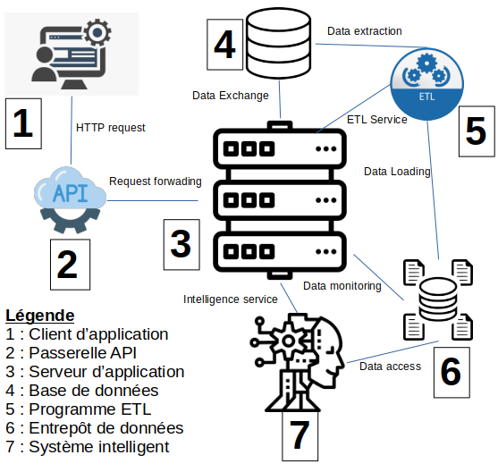

# Project
Système de gestion de la maintenance automobile et prototype d'un système d'aide au diagnostic automobile.

## Description
La maintenance automobile est un domaine du secteur de l’automobile qui a pour but de gérer les services d’entretien et de réparation des véhicules automobile. Les garagistes, acteurs de ce domaine, font face à certaines difficultés liés à la gestion des maintenances.

Tout garagiste souhaite la bonne gestion de ses affaires incluant la résolution des pannes qu’il a l’opportunité de rencontrer. Toutefois, la maintenance automobile requiert un haut niveau d’intelligence, parfois au dessus des capacités humaines pour résoudre ces derniers.

Dans le cadre du travail de fin d'étude pour l'obtention du diplôme de Master en informatique, nous apportons une solution dédiée à la bonne gestion des maintenances automobile. Le résultat que nous obtiendrons est un système d'informations de prise de décision capable d'assister les garagistes dans leur métier.

## Features

### Releases
1. Gestion informatisée des informations clients
2. Gestion informatisée des informations de maintenance
3. Service intelligent d'aide au diagnostic
4. Monitoring et reporting des informations de gestion

### Perspectives
5. Constitution d'un stock virtuel de pièces de rechanges
6. Service intelligent d'aide à la commande des pièces de rechanges
7. Gestion informatisée de l'approvisionnement en pièce de rechanges
8. Gestion informatisée des ressources humaines
9. Gestion informatisée des ressources matérielles
10. Gestion informatisée du flux financier
11. Elaboration du bilan comptable
